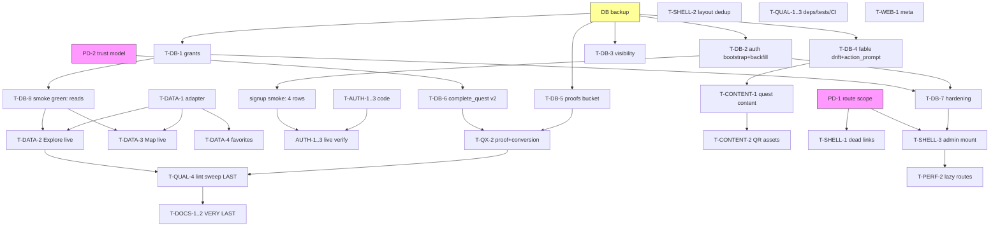

# SideQuests — Production Sprint Plan (Miami MVP)

**Date:** 2026-07-06
**Basis:** repo `main` at `6a06813`; live Supabase project `wvedvngtuzsttpavmgjw`; live Vercel project `sidequestsio` (production: `miamisidequests.io`)
**Supersedes nothing.** This plan operationalizes `docs/ROADMAP.md` Phase 1–2 within the constraints of `docs/PRODUCT_DIRECTION.md` and `docs/DECISIONS.md`. It proposes no architecture changes: Vite + React SPA, Supabase, Vercel, and the Repository pattern all remain.

## Evidence legend

Every claim and every task in this plan carries one of these tags:

| Tag | Meaning |
|---|---|
| **[C-live]** | Confirmed today against the live Supabase database via read-only MCP SQL |
| **[C-code]** | Confirmed today by reading source at commit `6a06813` |
| **[C-cmd]** | Confirmed today by running a command (`npm run lint`, `npm audit --omit=dev`) |
| **[D]** | Supported by repo documentation/audits (`docs/SYSTEM_STATE.md`, `docs/audits/*`), not independently re-verified today |
| **[V]** | Requires validation — unknown; do not build on this assumption |

---

## 0. Reality Verification Pass

This plan was preceded by a live verification of every open item in `docs/SYSTEM_STATE.md` §14. Several "unknowns" are now settled facts, and two audit recommendations were **revised** because the live database differs from what the checked-in migrations imply.

### 0.1 Status of the 10 known production blockers

| # | SYSTEM_STATE §14 blocker | Verified status today |
|---|---|---|
| 1 | Supabase anon read grants missing | **CONFIRMED [C-live].** `anon`/`authenticated` have no SELECT on any game table (`partners`, `venues`, `quests`, `qr_codes`, `rewards`, `community_notes`, `community_notes_with_author`, `leaderboard_snapshots`, …). Only `profiles` (S/I/U) and `public_profiles` (S) are granted. **Narrowed:** RLS is enabled *and* the public-read policies exist live (`quests_public_read`, `venues_public_read`, etc.) — the fix is a grants-only migration, not a policy rework. |
| 2 | `handle_new_auth_user` migration-order trap | **CONFIRMED FIRED [C-live].** The live function is the old version (inserts `users`, `user_profiles`, `privacy_preferences` — **no `profiles` row**). Both `auth.users` triggers (`on_auth_user_created`, `on_auth_user_created_game`) point at it. The `handle_new_user()` function that inserts `profiles` exists but has **no trigger**. Live evidence of damage: 6 `users` rows vs 5 `profiles` rows. New signups today get no profile row. |
| 3 | Fable quest fields missing from schema | **REVISED [C-live].** The live `quests` table **already has** `funky_action`, `action_type`, `proof_method`, `staff_phrase`, `social_share_prompt`, `estimated_time`, `links` — applied ad hoc, ahead of the repo. Missing live: **`action_prompt`** (expected at `src/types/db.ts:173` [C-code]). All 9 live quests have NULL in every Fable field and `seed_full.sql` never populates them [C-live][C-cmd]. The work is: add `action_prompt`, capture the drift in a checked-in migration, and **author content** — not create the columns. |
| 4 | `proofs` storage bucket missing | **CONFIRMED [C-live].** Only `avatars` exists. `src/lib/media.ts:29` uploads to `proofs` [C-code]; `QuestProofCamera.tsx:504-510` swallows the failure [C-code]. Note: `media.ts` also uploads video (`webm`/`mp4`), so bucket MIME/size limits must cover video. |
| 5 | Profile visibility field mismatch | **CONFIRMED [C-live].** `public_profiles` view filters `is_profile_public = true` (live view definition); Settings writes `is_public` [C-code]. `profiles` has **both** columns live. |
| 6 | Unreachable but linked routes | **CONFIRMED [C-code].** `src/App.tsx` mounts exactly the SYSTEM_STATE §7 route set. `Profile.tsx:138,145` links `/partner`, `/admin`; `QuestDetail.tsx:862` links `/app/wallet`. All 404. 5 partner pages + 7 admin pages + `AppHome`/`Wallet`/`Rewards`/`Leaderboard`/`History` exist unmounted. |
| 7 | Auth `next` redirect broken | **CONFIRMED [C-code].** `Auth.tsx:33` reads only `location.state.from`; the `?next=` param from `QuestDetail` is ignored. |
| 8 | Lint not clean | **CONFIRMED [C-cmd].** 25 errors / 14 warnings today (was 26/14 at audit). Almost all `@typescript-eslint/no-explicit-any`, plus one `no-require-imports` in `tailwind.config.ts:150`. |
| 9 | 10 production vulnerabilities | **CONFIRMED [C-cmd].** 7 high / 3 moderate. `react-router-dom` ≤6.30.2 XSS-via-open-redirect (fix available within v6 via `npm audit fix`), plus glob/lodash/minimatch/picomatch/brace-expansion/postcss/yaml — all with fixes available. |
| 10 | Non-`venue_code` completions trust-the-client | **CONFIRMED [C-live].** `complete_quest` verifies only `venue_code`. All 9 live quests are `verification_type='qr'` and no quest has a `verification_secret` [C-live]. This is a product decision (PD-2 below), not a bug. |

### 0.2 New findings from this verification (not in SYSTEM_STATE)

1. **Explore/Map card taps dead-end in production [C-code].** `Explore.tsx` and `MapView.tsx` render `DEMO_QUESTS` (`src/data/demo/demoQuests.ts`, slug ids like `quest-wynwood`); `AppQuestCard.tsx:36` navigates to `/quests/${quest.id}`; `QuestDetail` resolves via the repository against Supabase UUIDs. Every card/pin tap on the two primary mounted surfaces lands on a "quest not found" state against the live backend. This upgrades "demo/live inconsistency" from polish (Phase 2) to launch-blocking UX.
2. **Migration ledger drift [C-live].** The live migration ledger records only `0001_profiles`, `0002_profile_overhaul`, `0003_avatars_storage`, `0004_phone_social`. The game schema (`0006`), RLS (`0007`), RPCs (`0003_functions`), and `0008` were applied ad hoc (SQL editor), and the live DB has columns no migration creates. The repo's migrations are neither a record of the past nor a reliable recipe for the future. `supabase/README.md`'s prescribed order (functions **after** game schema) is itself the origin of blocker #2.
3. **No admin user exists [C-live].** All 6 `users` rows have `role='user'`. `is_admin()`-gated RPCs (`adjust_points`, `platform_analytics`) and any future `/admin` mount are unusable until a founder account is promoted.
4. **Community notes are post-moderated [C-live].** `community_notes.moderation_status` defaults to `'approved'`; the read policy shows approved-or-own-or-admin. Notes appear immediately without an admin in the loop — good for launch, but makes an admin moderation path an early-ops need, not a launch blocker.
5. **All 10 SECURITY DEFINER RPCs are EXECUTE-granted to `anon` and `authenticated` [C-live]** — including `adjust_points` and `platform_analytics` (internally guarded by `is_admin()`, but grants should still be tightened).
6. **CI/Vercel Node mismatch [C-code].** CI runs Node 20 (`.github/workflows/ci.yml`); Vercel builds on Node 24 [D]. CI also runs no lint and no tests.
7. **`index.html` ships wrong web presence [C-code].** OG/Twitter images point at `lovable.dev` assets, canonical is `https://sidequests.io` (production is `miamisidequests.io`), favicon loads from an external `storage.googleapis.com` URL.
8. **`CheckIn` placeholder doesn't match real codes [C-code][C-live].** UI suggests `WYNWOOD1`; live codes look like `BRKL-SKY1`, `CGRO-BAY1`. Cosmetic, but it's the first thing a tester types.
9. **Client-side self-heal is viable [C-live].** `profiles` has owner INSERT and UPDATE policies, so a signed-in user missing a `profiles` row can repair it from the client — but `completeOnboarding`/`updateProfile` use `.update()` today (`AuthContext.tsx:250,274` [C-code]), which no-ops on a missing row.
10. **Miami content assets already exist [C-code].** `src/data/miami/` contains geocoded venue locations, `funkyActions.json`, and a `toQuest.ts` transformer; `supabase/import_mapping.json` maps every mock id to the stable live UUIDs. Content authoring is an editing job, not a creation-from-scratch job.

### 0.3 Recommendations revised or dropped after verification

- **Revised:** "Add Fable quest fields migration" → columns exist live; work is `action_prompt` + drift-capture + content (§0.1 #3).
- **Revised:** "Fix migration-order trap" → the trap already fired; the fix must include a **backfill** for existing users and a client-side self-heal, not just a canonical function.
- **Narrowed:** "anon reads blocked" → grants-only; live policies verified present.
- **Downgraded:** "mount admin portal before launch for moderation" → notes are post-moderated (approved by default); admin mount is P1 operations, not P0.
- **Upgraded:** "demo/live data inconsistency" → P0-adjacent, because the mounted primary surfaces dead-end (§0.2 #1).

---

# 1. Production Readiness Assessment

### Strengths

- **The hard architecture is done and sound [C-code][D].** One `Repository` interface with Supabase/Local/Mock implementations (`src/lib/db/index.ts`), integrity-sensitive writes centralized in SECURITY DEFINER RPCs, append-only `points_ledger`, DB-level anti-farming (`unique(user_id, quest_id)`), privacy-aware analytics with small-sample suppression.
- **Live backend is closer to ready than the repo suggests [C-live].** 20 tables with RLS enabled, public-read policies present, RPCs installed, catalog seeded (7 partners / 9 venues / 9 quests / 9 QR codes / 10 rewards), Fable columns present.
- **Deployment pipeline works [D].** Vercel production READY at `6acfeee`, clean build, no runtime errors in 7 days, correct env vars present in prod+preview.
- **Typecheck and build pass [C-cmd][D]**; the marketing site is stable and untouched.
- **Docs discipline is unusually good** — SYSTEM_STATE/ROADMAP/DECISIONS/audits made this plan possible without guesswork.

### Weaknesses

- **The live data path is fully broken for the SPA [C-live]:** no grants → every Supabase read of the game tables fails; the app silently falls back to… nothing on `/app/quests` (explicit error, correct) and demo data on Explore/Map (misleading).
- **Signup lifecycle is broken [C-live]:** no `profiles` row on signup → onboarding bypass → undefined profile UX.
- **Primary surfaces run on hardcoded demo data with dead-end links [C-code].**
- **Zero automated tests; CI doesn't lint [C-code].** Non-strict TypeScript [D].
- **Schema truth lives in the dashboard's history, not the repo [C-live].**

### Launch risks (business-facing)

- A visitor who scans a real QR today hits grant-blocked reads → broken first impression.
- A business partner shown "their" quest page sees NULL Fable content (no funky action, no links) [C-live].
- No admin account → no operational lever (points adjustment, note takedown) without SQL access [C-live].
- Rewards redemption flow has never run end-to-end against live (0 redemptions, 0 completions ever) [C-live].

### Technical risks

- All schema changes go against a live production DB with real auth users (6) — every migration must be idempotent, reviewed, and preceded by a backup.
- Vercel **preview** deployments share the production Supabase project (same env var names present in Preview [D]) — preview testing writes production rows. Accepted for now; see risk register.
- The `.mcp.json` Supabase server is **read-only** [C-code], so agents cannot apply migrations; a human applies them (see §10 gates).

### Business risks

- Content quality (9 quests' Fable copy) is founder work; engineering can't unblock it.
- Partner value proof depends on `partner_analytics` output that has never been exercised with real traffic.

### Unknowns [V] — all tracked, none assumed

| Unknown | Why it matters | How to resolve |
|---|---|---|
| Mapbox token URL allowlist includes `miamisidequests.io` + vercel.app domains | Map tab breaks in prod if not | Mapbox dashboard check (LC-14) |
| Supabase Auth settings: email confirmation, enabled providers, Site URL / redirect allowlist | Signup/confirm emails may redirect to wrong origin | Supabase dashboard check (LC-15) |
| Actual values of the 3 Vercel env vars (Sensitive-typed, unreadable) | A stale anon key would break everything despite "present" | Production smoke test proves them (T-DB-8) |
| Vercel auto-deploys `main` to production | Merge-order plan assumes it | One test push / dashboard check (LC-16) |
| Marketing `/quests` page card link targets | Possible third dead-end surface | 10-minute code check inside T-DATA-1 |
| `RequireRole`/role plumbing for admin mount (ARCHITECTURE.md is stale here) | Gates T-ROUTE-3 | Code inspection first step of T-ROUTE-3 |
| `markScanConverted` direct table update fails under RLS (no UPDATE policy per audit [D]) | Scan→completion conversion metric silently lost | Fixed by design in T-QX-2 regardless |

### Confidence level

**Moderate-high.** The blocking work is narrow, well-understood, and mostly SQL + small TypeScript diffs. Every launch blocker has a verified root cause and a bounded fix. The two schedule risks are founder-dependent content authoring and the [V] items above — none of which are engineering unknowns.

---

# 2. Critical Path

### Product decisions required first (founder, ~30 minutes, recorded in DECISIONS.md)

- **PD-1 — Launch route scope.** Recommendation: keep current mounted set; **remove** dead links (`/partner`, `/admin`, `/app/wallet`) now; mount `/admin` (role-gated) during Sprint 2 for ops; do **not** mount wallet (paused per DECISIONS.md 2026-07-06), rewards, leaderboard, or partner portal for launch day; partner analytics delivered concierge-style from `partner_analytics` until the portal is validated post-launch (consistent with ROADMAP Phase 3).
- **PD-2 — Verification trust model.** Recommendation: launch `qr` quests as documented lightweight check-ins (trust-the-client), with one cheap server-side tightening: `complete_quest` requires a recorded `scan_event` for that quest/session when `verification_type='qr'`. Defer GPS/staff enforcement (ROADMAP Phase 3).
- **PD-3 — Product analytics sink.** Recommendation: none new for launch; `track()` keeps its local sink; partner value comes from `partner_analytics`. Optional: Vercel Web Analytics as a one-package add in Sprint 3 if wanted.

### P0 — launch blockers (nothing ships around these)

| ID | Item | Evidence |
|---|---|---|
| P0-1 | Grants migration (schema usage + SELECT on public read surfaces + authenticated self-service + RPC execute reconciliation) | [C-live] §0.1#1 |
| P0-2 | Auth bootstrap fix: canonical `handle_new_auth_user` (adds `profiles` insert), single trigger, **backfill** missing `profiles` rows, drop orphan `handle_new_user` | [C-live] §0.1#2 |
| P0-3 | Profile visibility: view filters canonical `is_public`; backfill from `is_profile_public` | [C-live] §0.1#5 |
| P0-4 | `proofs` bucket + policies (image+video MIME, owner-scoped writes) | [C-live] §0.1#4 |
| P0-5 | `quests.action_prompt` column + drift-capture migration committed to repo | [C-live] §0.1#3 |
| P0-6 | Client auth lifecycle: `?next=` redirect, null-profile repair path, onboarding upsert | [C-code] §0.1#7, §0.2#9 |
| P0-7 | Kill dead-end UX: remove dead links; Explore/Map consume live repository data (or the explicit PD-1 alternative) | [C-code] §0.1#6, §0.2#1 |
| P0-8 | Live smoke verification green (script + manual pass on production domain) | gates everything |

### P1 — required for a *credible* launch (same sprint window, not gating the fix-deploy loop)

Proof-upload error surfacing; scan-conversion via RPC; admin role bootstrap + `/admin` mount; RPC grant hardening + function `search_path` + leaked-password toggle; Fable content authored for 9 quests; QR printable assets; lint zero + `npm audit fix`; CI upgraded (Node 24, lint, tests); unit tests for ledger/leveling/adapter; runbook + docs refresh; layout dedup.

### P2 — quality within launch window if time permits

Bundle splitting (supabase client unification, route-lazy portals); `index.html` meta/OG/favicon/canonical; avatars listing-policy tightening; `public_profiles` → `security_invoker`; CheckIn placeholder; Vercel Analytics (PD-3).

### P3 — explicitly after launch

Strict TypeScript; staging Supabase project for previews; analytics rollups job; rate limiting; partner portal self-serve; leaderboard/rewards/wallet mounts; verification hardening beyond PD-2; sitemap.

### Blocking semantics

- **P0-1 and P0-2 block all live testing** — nothing downstream can be validated until reads work and signups produce profiles. They are pure SQL, independent of each other, and can land the same day.
- **P0-7 (Explore/Map live data) must not begin before P0-1 is applied** — the adapter work is testable only with readable quests. (Code can be written against LocalRepository in parallel; final verification needs P0-1.)
- **Content authoring (P1) must not begin until P0-5 lands** (`action_prompt` column) — else the content SQL has nowhere to write.
- **Lint sweep merges last** in any sprint — it touches many files and would conflict with feature branches.
- Everything in P2 is parallelizable and non-blocking.

---

# 3. Workstream Breakdown

> Complexity scale: **S** ≤ 2h agent time, **M** ≈ half-day, **L** ≈ 1–2 days. All file paths verified to exist at `6a06813`.

### WS-A — Database & Migrations *(the backbone; everything else waits on A1–A2)*

- **Objective:** live DB and repo migrations converge on one verified, checked-in truth; public reads work; signups bootstrap fully.
- **Scope:** new idempotent migrations `0009`–`0013`; verification + smoke scripts; supabase/README rewrite of the (currently trap-laden) execution order. Out of scope: any destructive change, any data deletion.
- **Files:** `supabase/migrations/0009_grants.sql` (new), `0010_auth_bootstrap.sql` (new), `0011_profile_visibility.sql` (new), `0012_quest_fable_fields.sql` (new), `0013_proofs_bucket.sql` (new), `scripts/verify-db.sql` (new), `scripts/smoke-supabase.ts` (new), `supabase/README.md`.
- **Complexity:** M overall (each migration S, correctness review is the cost).
- **Dependencies:** none. **Human gate:** applies each migration in the Supabase SQL editor after PR review (MCP is read-only [C-code]); DB backup first.
- **Success criteria:** `scripts/verify-db.sql` shows expected grants/trigger/view/columns; anon REST read of `quests` returns 9 rows; a fresh test signup creates all 4 rows (`users`, `user_profiles`, `privacy_preferences`, `profiles`); `users` count == `profiles` count after backfill.

### WS-B — Auth & Profile Lifecycle

- **Objective:** signup → onboarding → profile → protected app is airtight even when the DB trigger misbehaves.
- **Scope:** `?next=` redirect (with same-origin validation); treat signed-in + missing profile as repair state; `completeOnboarding`/profile repair via upsert (INSERT policy exists [C-live]).
- **Files:** `src/pages/Auth.tsx`, `src/contexts/AuthContext.tsx`, `src/components/ProtectedRoute.tsx`, `src/pages/app/AppLayout.tsx`, `src/pages/Onboarding.tsx`.
- **Complexity:** M. **Dependencies:** none to write; WS-A applied to fully verify.
- **Success criteria:** deep link → sign-in → return-to-quest works via both `state.from` and `?next=`; a user whose `profiles` row is deleted gets routed to onboarding and self-heals; no protected page renders with `profile === null`.

### WS-C — Quest Data Unification (kills the demo/live split on mounted surfaces)

- **Objective:** every mounted app surface reads the repository; demo catalogues stop leaking into production UX.
- **Scope:** one adapter `QuestWithContext → card/pin shape`; Explore + MapView consume the same repository query as QuestBrowser (TanStack Query, shared hook); Favorites keys on live UUIDs with graceful handling of stale demo ids; verify marketing `/quests` link targets [V→resolve]. Marketing page itself stays static (it's a showcase, per SYSTEM_STATE §11 scoped decision [D]) — only its dead links (if any) change.
- **Files:** `src/lib/questAdapter.ts` (new), `src/pages/app/Explore.tsx`, `src/pages/app/MapView.tsx`, `src/pages/app/Favorites.tsx`, `src/contexts/FavoritesContext.tsx`, `src/components/app/AppQuestCard.tsx` (only if the card type needs loosening), map components' pin typing (`src/components/map/QuestMap.tsx` expects `lat`/`lng` [C-code] — adapter supplies from `venue.latitude/longitude` [D: 0006_game_schema.sql:163-172]).
- **Complexity:** L (largest app-code item; touches the shared `Quest` type surface SYSTEM_STATE flagged [D]).
- **Dependencies:** P0-1 applied for live verification; none for writing.
- **Success criteria:** with Supabase configured, Explore/Map/Favorites show the 9 live quests; every card/pin tap resolves to a working `/quests/:uuid` page; with Supabase absent, LocalRepository data renders (fallback per DECISIONS.md); `DEMO_QUESTS` no longer imported by any mounted page (`grep` gate).

### WS-D — Routing & App Shell

- **Objective:** no link 404s; one layout shell; admin ops path exists.
- **Scope:** remove `/partner`, `/admin`, `/app/wallet` links (PD-1); collapse the duplicated `AppLayout` (route shell `src/pages/app/AppLayout.tsx` stays; component wrapper `src/components/app/AppLayout.tsx` removed from the 5 mounted double-shell pages [C-code]: `QuestBrowser`, `AppCommunityNotes`, `CheckIn`, `Profile`, `Settings`); Sprint-2: mount `/admin/*` behind a role guard after verifying role plumbing [V]; promote founder account to admin (ops, SQL).
- **Files:** `src/pages/app/Profile.tsx`, `src/pages/QuestDetail.tsx` (wallet link only — coordinate with WS-E ownership), `src/components/app/AppLayout.tsx` + the 5 pages, `src/App.tsx`, `src/pages/admin/*` (mount only), `src/components/dashboard/navs.ts`.
- **Complexity:** M. **Dependencies:** PD-1 decision; admin mount depends on role-plumbing verification.
- **Success criteria:** crawling every rendered `<Link>`/`navigate` target from mounted pages yields no `NotFound`; each mounted app page renders exactly one bottom nav; `/admin` reachable for the admin user, 404/redirect for others.

### WS-E — Quest Experience & Proof

- **Objective:** the core loop (scan → detail → complete → proof → note) is honest about failures and consistent end-to-end.
- **Scope:** surface proof-upload failures (toast + retry/post-without-photo choice) instead of the silent `catch {}` at `QuestProofCamera.tsx:507`; move scan-conversion into the RPC layer (extend `complete_quest` with optional `p_scan_event_id` or add `mark_scan_converted` RPC — removes the policy-less direct UPDATE [D]); PD-2 tightening in `complete_quest`; CheckIn placeholder → real code format (`BRKL-SKY1` style [C-live]).
- **Files:** `src/components/app/QuestProofCamera.tsx`, `src/lib/media.ts` (error typing only), `src/lib/db/supabase/SupabaseRepository.ts`, `supabase/migrations/0014_complete_quest_v2.sql` (new), `src/pages/app/CheckIn.tsx`.
- **Complexity:** M. **Dependencies:** P0-4 (bucket) for proof verification; WS-A conventions for the migration.
- **Success criteria:** with the bucket present, proof photo lands in `proofs/{userId}/quests/{questId}/…` and note carries `image_url`; with upload forced to fail, user sees the failure and chooses; completion marks the scan converted server-side (row visible in `scan_events.converted` [D: field per 0006 schema]).

### WS-F — Launch Content & Business Onboarding *(founder + agent pairing)*

- **Objective:** the 9 live quests read like the product vision (funky, specific, social), and a business can be onboarded via a documented concierge path.
- **Scope:** content SQL template per quest (Fable fields incl. `action_prompt`, `links` JSONB with real URLs, `estimated_time`); source material from `src/data/miami/funkyActions.json` + `miamiQuestLocations.geocoded.json` [C-code]; printable QR one-pagers for the 9 seeded codes (`BRKL-SKY1`…) pointing at `https://miamisidequests.io/scan/<code>`; concierge onboarding runbook (create partner/venue/quest/QR via SQL or admin UI once mounted); decide rewards copy but **do not** mount rewards (PD-1).
- **Files:** `supabase/content/2026-07-quest-content.sql` (new), `docs/RUNBOOK.md` (new), `scripts/generate-qr.ts` (new, optional — or produce PNGs manually; no new prod dependency).
- **Complexity:** M engineering + founder copywriting time. **Dependencies:** P0-5 applied.
- **Success criteria:** all 9 quests have non-NULL `funky_action`, `action_type`, `proof_method`, `action_prompt`, `social_share_prompt`, `estimated_time`; `links` populated where the business has URLs; QuestDetail renders the full Fable experience for each (visual pass on production).

### WS-G — Security Hardening

- **Objective:** close the advisor findings that are cheap and safe pre-launch; schedule the rest.
- **Scope (pre-launch):** revoke `anon` EXECUTE on non-anon RPCs (keep `record_scan`, `get_leaderboard` anon [C-live semantics]); revoke client EXECUTE entirely on trigger/internal functions (`handle_new_auth_user`, `handle_new_user`, `rls_auto_enable`); pin `search_path` on the 6 mutable functions [D: advisors]; enable leaked-password protection (dashboard, ops [D: advisors]). **Scope (P2):** avatars broad-list policy; `public_profiles` → `security_invoker` + explicit `is_public` RLS policy (view is SECURITY DEFINER today — advisor ERROR [C-live]).
- **Files:** `supabase/migrations/0015_rpc_hardening.sql` (new); dashboard ops item.
- **Complexity:** S–M. **Dependencies:** after P0 migrations settle (avoid interleaving grant changes).
- **Success criteria:** advisors list shrinks accordingly; anon can still `record_scan` and read leaderboard; signed-in completion/redemption still work (smoke re-run).

### WS-H — Quality Infrastructure

- **Objective:** CI actually protects the branch agents are merging into.
- **Scope:** fix 25 lint errors/14 warnings [C-cmd]; `npm audit fix` (all 10 have non-breaking fixes available — React Router stays v6 line [C-cmd]); CI: Node 24 (match Vercel), add `lint` + `test` steps; introduce Vitest with focused unit tests: `leveling.ts` XP curve, `questAdapter`, `scanFlow` code resolution, `Auth` next-param validation, LocalRepository completion guards (double-award, inventory) [C-code targets exist].
- **Files:** `.github/workflows/ci.yml`, `package.json` (+`vitest` devDep, `test` script), `src/lib/**` touched by lint fixes, `tests/` or colocated `*.test.ts`.
- **Complexity:** M. **Dependencies:** lint sweep merges after feature PRs (conflict management).
- **Success criteria:** `npm run lint` → 0/0; `npm audit --omit=dev` → 0 high; CI green on Node 24 with typecheck+lint+test+build; ≥ 15 meaningful assertions over the ledger/leveling/adapter logic.

### WS-I — Performance (P2)

- **Objective:** get the main chunk under control without re-architecting.
- **Scope:** unify on one Supabase client module (today: static `src/lib/supabase.ts` + lazy `src/lib/supabase/client.ts` defeat the code-split [C-code][D]); `React.lazy` the admin/partner routes when mounted (keeps Recharts out of the main bundle); `build.rollupOptions.manualChunks` for react/radix vendor split; measure before/after.
- **Files:** `src/lib/supabase.ts`, `src/lib/supabase/client.ts` and its importers, `vite.config.ts`, `src/App.tsx` (lazy wrappers).
- **Complexity:** M. **Dependencies:** after WS-D route decisions merge.
- **Success criteria:** build warning count drops; main chunk measurably smaller (target < 800 KB minified; current ~1.1 MB [D]); no behavior change (smoke re-run).

### WS-J — Web Presence & Meta (P2)

- **Objective:** the site presents as SideQuests, not as a Lovable scaffold.
- **Scope:** own OG image in `public/`, canonical → `https://miamisidequests.io`, local favicon, correct titles; robots.txt already permissive [C-code].
- **Files:** `index.html`, `public/` assets.
- **Complexity:** S. **Dependencies:** none. **Success criteria:** social-card validators show the SideQuests image; no external favicon/OG requests.

### WS-K — Documentation & DX

- **Objective:** docs match post-sprint reality; the next contributor (or agent) can't fall into the old traps.
- **Scope:** rewrite `ARCHITECTURE.md` (stale routes/migrations [D: SYSTEM_STATE §15]); correct `supabase/README.md` execution order + archive superseded migrations (`0001_schema.sql`, `0002_rls.sql` → `supabase/migrations/archive/`); `docs/RUNBOOK.md` (WS-F); refresh `SYSTEM_STATE.md` + `CHANGELOG.md` at sprint end; append PD-1/2/3 to `DECISIONS.md`.
- **Files:** as listed. **Complexity:** M. **Dependencies:** last, after reality settles.
- **Success criteria:** a clean-room read of the docs reproduces the live system without contradiction; every §14 blocker in SYSTEM_STATE is marked resolved-with-evidence or explicitly deferred.

---

# 4. Agentic Execution Plan

> Tasks are sized for one autonomous agent each, with non-overlapping file ownership. **Validation** = what the agent runs; **Gate** = what a human confirms. Rollback risk: migrations are forward-only against prod (hence idempotency + backup); app tasks are plain PR reverts (low).

### Stream DB (Agent-DB) — sequential within stream

| ID | Task | Files | Validation | Completion criteria | Rollback risk |
|---|---|---|---|---|---|
| **T-DB-0** | Write `scripts/verify-db.sql`: read-only introspection of grants, triggers, function bodies, view defs, quest columns, buckets, policies — the reality gate used after every apply | `scripts/verify-db.sql` | run via read-only MCP; output matches §0 findings | Committed; documented in README | none (read-only) |
| **T-DB-1** | `0009_grants.sql`: `GRANT USAGE ON SCHEMA public`; SELECT to `anon`+`authenticated` on `partners, venues, quests, qr_codes, rewards, community_notes, community_notes_with_author, leaderboard_snapshots`; authenticated SELECT/INSERT/UPDATE where RLS self-scopes (`users`, `user_profiles`, `privacy_preferences`, `consent_events` insert, `note_reports` insert, `quest_attempts`/`quest_completions`/`points_ledger`/`reward_redemptions` SELECT-own); idempotent | `supabase/migrations/0009_grants.sql` | after human apply: T-DB-0 diff; anon REST `GET /rest/v1/quests` returns 9 rows | Anon discovery works end-to-end | Low: GRANT-only, reversible by REVOKE; RLS still guards rows [C-live] |
| **T-DB-2** | `0010_auth_bootstrap.sql`: canonical `handle_new_auth_user` (all 4 inserts, `on conflict do nothing`); exactly one trigger (`drop trigger if exists on_auth_user_created_game`); drop function `handle_new_user` (its policy-relevant behavior merged); **backfill**: insert missing `profiles` (and `users`/`user_profiles`/`privacy_preferences`) for existing `auth.users` | `supabase/migrations/0010_auth_bootstrap.sql` | test signup (throwaway email) creates 4 rows; `select count(*) from users` == `from profiles` | New + existing users all have profiles | Medium: touches auth path — apply in low-traffic window, backup first |
| **T-DB-3** | `0011_profile_visibility.sql`: `update profiles set is_public = is_profile_public where is_public is distinct from is_profile_public`; recreate `public_profiles` filtering `is_public`; keep old column (drop is P3) | `supabase/migrations/0011_profile_visibility.sql` | toggle in Settings on a test account flips `/u/:username` visibility | Settings toggle governs public view | Low |
| **T-DB-4** | `0012_quest_fable_fields.sql`: `alter table quests add column if not exists action_prompt text`; plus `add column if not exists` for all 7 existing Fable columns + `links jsonb` — capturing live drift so a fresh environment reproduces prod | `supabase/migrations/0012_quest_fable_fields.sql` | T-DB-0 shows column; migration re-run is a no-op | Repo migration set recreates live schema | Low (additive) |
| **T-DB-5** | `0013_proofs_bucket.sql`: `proofs` bucket — public read, authenticated insert scoped to `auth.uid()::text = (storage.foldername(name))[1]`, 25 MB, MIME `image/webp,image/jpeg,image/png,video/webm,video/mp4` (media.ts emits webp/webm/mp4 [C-code]) | `supabase/migrations/0013_proofs_bucket.sql` | authenticated test upload succeeds; anon upload fails; public URL fetch works | Proof uploads land | Low |
| **T-DB-6** | `0014_complete_quest_v2.sql` (with WS-E): optional `p_scan_event_id` param marks scan converted in-transaction; PD-2 check (qr-type requires matching scan event) | `supabase/migrations/0014_complete_quest_v2.sql` | RPC call with/without scan id behaves; double-completion still blocked | Conversion server-side; PD-2 enforced | Medium: core RPC — keep old behavior for absent param |
| **T-DB-7** | `0015_rpc_hardening.sql`: REVOKE anon EXECUTE on `complete_quest, start_quest, redeem_reward, create_community_note, adjust_points, create_qr_code, partner_analytics, platform_analytics`; revoke all client EXECUTE on `handle_new_auth_user, rls_auto_enable`; `alter function … set search_path = public` × 6 [D: advisors] | `supabase/migrations/0015_rpc_hardening.sql` | advisors re-run: warnings drop; smoke suite still green | Attack surface reduced, flows intact | Medium: over-revoke breaks flows — smoke gate mandatory |
| **T-DB-8** | `scripts/smoke-supabase.ts`: anon-key runtime smoke (env-driven): list quests, resolve a QR code, read notes view, `get_leaderboard`; prints PASS/FAIL table; used as post-apply + post-deploy gate | `scripts/smoke-supabase.ts`, `package.json` script | run against live with anon key | Repeatable reality check exists | none |

### Stream AUTH (Agent-Auth) — after T-DB-2 applied for full verification; code-parallel before that

| ID | Task | Files | Validation | Completion criteria |
|---|---|---|---|---|
| **T-AUTH-1** | `?next=` support: `Auth.tsx` prefers validated same-origin relative `next` param, falls back to `state.from`, then `/app`; reject absolute/protocol-relative URLs | `src/pages/Auth.tsx` | unit test the parser; manual deep-link pass | QuestDetail → auth → back-to-quest works |
| **T-AUTH-2** | Null-profile repair: `AuthContext.fetchProfile` distinguishes no-row from error; on no-row, attempt self-insert (INSERT policy exists [C-live]); `ProtectedRoute`/`AppLayout` route `user && !profile` to `/onboarding` | `src/contexts/AuthContext.tsx`, `src/components/ProtectedRoute.tsx`, `src/pages/app/AppLayout.tsx` | delete test user's profile row; app routes to onboarding and repairs | No protected render with null profile |
| **T-AUTH-3** | `completeOnboarding` + profile repair use `upsert` (id-scoped) instead of `update` | `src/contexts/AuthContext.tsx` | onboarding completes for a user with no row | Self-heal complete |

### Stream SHELL (Agent-Auth owns; sequenced after AUTH tasks in same branch or separate PR)

| ID | Task | Files | Validation | Completion criteria |
|---|---|---|---|---|
| **T-SHELL-1** | Remove dead links: `/partner` + `/admin` cards from `Profile.tsx:134-146`; CheckIn placeholder → `BRKL-SKY1` format | `src/pages/app/Profile.tsx`, `src/pages/app/CheckIn.tsx` | grep for `to="/partner"`, `to="/admin"` = 0 in mounted pages | No mounted 404 links (wallet link handled in T-QX-1's file) |
| **T-SHELL-2** | Layout dedup: strip `components/app/AppLayout` wrapper from the 5 mounted pages; delete wrapper only if unmounted pages that still use it are also updated or it's retained for them with a `@deprecated` note | 5 page files + `src/components/app/AppLayout.tsx` | visual pass: exactly one bottom nav per page | Consistent shell |
| **T-SHELL-3** | *(Sprint 2, gated on PD-1 + role-plumbing check [V])* Mount `/admin/*` lazily behind a role guard; verify `is_admin()` ↔ `users.role` path end-to-end; ops: promote founder user to admin via SQL (runbook step, human-applied) | `src/App.tsx`, `src/pages/admin/*`, guard component (verify existing `RequireRole` or add) | admin account sees portal; user account gets redirect; non-admin RPCs still blocked | Ops lever exists |

### Stream DATA (Agent-Data)

| ID | Task | Files | Validation | Completion criteria |
|---|---|---|---|---|
| **T-DATA-1** | Adapter + shared hook: `questAdapter.ts` maps `QuestWithContext` → card/pin shape (`lat`/`lng` from venue); `useLiveQuests()` TanStack hook shared by Explore/Map/QuestBrowser; verify marketing `/quests` link targets while in there [V→resolved] | `src/lib/questAdapter.ts` (new), `src/hooks/useLiveQuests.ts` (new) | unit tests: adapter handles null venue/nulls | Adapter is the single demo→live seam |
| **T-DATA-2** | Explore on live data: repository quests + explicit loading/error/empty states (pattern already in QuestBrowser post-`ad1341e` [D]) | `src/pages/app/Explore.tsx` | with Supabase: 9 live quests, taps resolve; without: LocalRepository content | No `DEMO_QUESTS` import |
| **T-DATA-3** | Map on live data: pins from adapter; popup links to `/quests/:uuid` | `src/pages/app/MapView.tsx`, `src/components/map/*` typing only as needed | pin tap → working detail page | No `DEMO_QUESTS` import |
| **T-DATA-4** | Favorites on live ids: store UUIDs; stale slug ids ignored gracefully; drop `src/data/miami` dependency from `Favorites.tsx` [C-code] | `src/contexts/FavoritesContext.tsx`, `src/pages/app/Favorites.tsx` | favorite → appears; pre-existing demo favorites don't crash | Favorites works on live data |

### Stream QX (Agent-Data owns quest-experience files)

| ID | Task | Files | Validation | Completion criteria |
|---|---|---|---|---|
| **T-QX-1** | Remove `/app/wallet` link from completion screen (`QuestDetail.tsx:857-863`); replace with profile/XP affordance | `src/pages/QuestDetail.tsx` | completion screen has no 404 link | Wallet stays paused (DECISIONS.md) |
| **T-QX-2** | Proof-upload failure surfaced: replace silent `catch {}` (`QuestProofCamera.tsx:504-510`) with toast + retry / post-without-photo choice; SupabaseRepository passes scan id to `complete_quest` v2 and drops direct `scan_events` UPDATE | `src/components/app/QuestProofCamera.tsx`, `src/lib/db/supabase/SupabaseRepository.ts` | forced-failure test shows choice UI; conversion row updates server-side | Honest proof flow |

### Stream CONTENT (Agent-Content + founder)

| ID | Task | Files | Validation | Completion criteria |
|---|---|---|---|---|
| **T-CONTENT-1** | Content SQL template + draft copy for 9 quests from `funkyActions.json`/geocoded data; founder edits; human applies | `supabase/content/2026-07-quest-content.sql` | all Fable fields non-NULL on 9 quests [C-live query] | QuestDetail renders full experience |
| **T-CONTENT-2** | QR printables for 9 codes → `/scan/<code>` URLs | `scripts/generate-qr.ts` or manual assets | scan phone-camera → resolves | Physical assets ready |
| **T-CONTENT-3** | `docs/RUNBOOK.md`: concierge business onboarding (partner/venue/quest/QR creation), admin ops (promote role, moderate note, adjust points), incident basics (advisors, logs, rollback contacts) | `docs/RUNBOOK.md` | dry-run: onboard a fake business end-to-end using only the runbook | Business onboarding is executable |

### Stream QUAL (Agent-Qual)

| ID | Task | Files | Validation | Completion criteria |
|---|---|---|---|---|
| **T-QUAL-1** | `npm audit fix` + verify build/typecheck/manual-smoke (React Router within v6 [C-cmd]) | `package.json`, `package-lock.json` | audit 0 high; app boots; routes work | Deps clean |
| **T-QUAL-2** | Vitest + unit tests (leveling, adapter, scanFlow, next-param, LocalRepository guards) | `package.json`, `vitest.config.ts`, test files | `npm test` green | Logic under test |
| **T-QUAL-3** | CI: Node 24, add lint + test steps | `.github/workflows/ci.yml` | CI green on a probe PR | Branch protection meaningful |
| **T-QUAL-4** | **Last-merge** lint sweep: fix 25 errors/14 warnings | many files (types only) | lint 0/0; typecheck; build | Clean baseline |

### Stream WEB/PERF/DOCS (Agent-Qual or Agent-Content capacity)

| ID | Task | Files | Completion criteria |
|---|---|---|---|
| **T-WEB-1** | OG image, canonical `miamisidequests.io`, local favicon | `index.html`, `public/` | validators pass; no external asset refs |
| **T-PERF-1** | Single Supabase client module; remove dual static/dynamic import [C-code] | `src/lib/supabase.ts`, `src/lib/supabase/client.ts`, importers | build warning gone |
| **T-PERF-2** | Route-lazy admin (and partner when mounted) + `manualChunks` vendor split | `src/App.tsx`, `vite.config.ts` | main chunk < 800 KB min |
| **T-DOCS-1** | Rewrite `ARCHITECTURE.md`; fix `supabase/README.md` order; archive superseded migrations | as named | clean-room read reproduces reality |
| **T-DOCS-2** | Refresh `SYSTEM_STATE.md`, `CHANGELOG.md`; append PD-1/2/3 to `DECISIONS.md` | as named | every §14 blocker dispositioned |

### Suggested execution order (agent-parallel)

```
Day 0:   T-DB-0 → T-DB-1 → T-DB-2 → T-DB-3/4/5 (apply+verify each)   [Agent-DB + human applier]
         T-AUTH-1..3, T-SHELL-1..2 written in parallel                [Agent-Auth]
         T-DATA-1 written in parallel (LocalRepository-testable)      [Agent-Data]
Day 1-2: merge AUTH+SHELL → merge DATA-1..4 → T-QX-1..2 (+T-DB-6)     [verify vs live]
         T-CONTENT-1 drafting starts (after T-DB-4 applied)           [Agent-Content+founder]
Day 3-4: T-DB-7 hardening; T-SHELL-3 admin mount; T-QUAL-1..3; T-WEB-1
Day 5+:  T-CONTENT-2..3; T-PERF-1..2; T-QUAL-4 (last); T-DOCS-1..2 (very last)
```

---

# 5. Dependency Graph



**Fully parallel from hour zero:** DB stream; AUTH/SHELL code; DATA-1; QUAL-1..3; WEB-1; CONTENT drafting (copy only).
**Hard sequence:** backup → DB applies → smoke → live-data verification of everything else. QUAL-4 (lint) merges after all feature PRs; DOCS merge last.

### PR / merge order

| # | PR | Owner | Why this position |
|---|---|---|---|
| 1 | migrations 0009–0013 + verify/smoke scripts | Agent-DB | unblocks all live testing; no app-code conflicts |
| 2 | AUTH-1..3 + SHELL-1..2 | Agent-Auth | fixes lifecycle before surfaces go live-data |
| 3 | DATA-1..4 | Agent-Data | largest diff; rebases on #2's page touches (Profile/CheckIn only — disjoint files otherwise) |
| 4 | QX-1..2 + 0014 | Agent-Data | builds on #1/#3 |
| 5 | QUAL-1 (audit fix) + QUAL-2..3 (CI/tests) | Agent-Qual | lockfile isolated; CI protects later merges |
| 6 | SHELL-3 admin mount + 0015 hardening | Agent-Auth + Agent-DB | after PD-1 + role verification |
| 7 | WEB-1, PERF-1..2, content SQL | mixed | low conflict |
| 8 | QUAL-4 lint sweep | Agent-Qual | touches many files — last feature-adjacent merge |
| 9 | DOCS-1..2 | Agent-Content | documents final reality |

---

# 6. Sprint Plan

> "Sprint" = a focused block, not a calendar fortnight. Estimated wall-clock assumes 3–4 agents in parallel plus founder availability for decisions/content/applies.

### Sprint 0 — "Turn the backend on" (≈ 1 day)

- **Goal:** live Supabase serves the app; signups are whole.
- **Deliverables:** PD-1/2/3 recorded; DB backup; migrations 0009–0013 applied + verified; smoke script green; backfill confirmed (`users == profiles` count).
- **Definition of done:** anon REST returns quests; fresh signup produces 4 rows; Settings visibility toggle affects `/u/:username`; `verify-db.sql` output archived in the PR.
- **Risk:** low-medium (prod DB changes; mitigated by idempotency + backup + low-traffic window — site has zero activity data [C-live]).
- **User impact:** `/app/quests`, `/quests/:id`, `/scan/:code` start working against real data.

### Sprint 1 — "No dead ends" (≈ 2–3 days)

- **Goal:** every mounted surface is live-data and every link resolves; auth lifecycle is self-healing.
- **Deliverables:** PRs #2–#4 merged + deployed; production manual smoke on a real phone (scan → auth → complete → proof → note).
- **Definition of done:** zero `NotFound` from mounted-page links (crawl check); no `DEMO_QUESTS` imports in mounted pages; deep-link auth round-trip works; proof failure is visible; one bottom nav everywhere.
- **Risk:** medium (largest app diffs; TanStack patterns already exist to copy).
- **User impact:** the core loop works end-to-end for a stranger with a phone.

### Sprint 2 — "Credible launch" (≈ 2–3 days)

- **Goal:** content, ops, security, and CI reach launch grade.
- **Deliverables:** 9 quests fully authored; QR printables; admin mounted + founder promoted; 0014/0015 applied; audit clean; CI (Node 24 + lint + tests) green; runbook drafted.
- **Definition of done:** QuestDetail shows complete Fable content for all 9; admin can moderate a note and adjust points via UI; advisors reduced; `npm audit --omit=dev` 0 high; a fake business onboarded using only the runbook.
- **Risk:** medium — founder copy time is the long pole; RPC hardening needs careful smoke.
- **User impact:** quests feel like the product vision; a business can be onboarded tomorrow.

### Sprint 3 — "Polish, measure, launch" (≈ 2 days + launch)

- **Goal:** performance/meta polish, partner-value proof, launch checklist execution, GO/NO-GO.
- **Deliverables:** PERF-1..2, WEB-1, lint zero, docs refreshed; first concierge partner report generated from `partner_analytics`; full launch checklist (§7) executed; dry-run event with 3–5 friendly users completing real quests in Miami.
- **Definition of done:** checklist 100% checked or consciously waived with a DECISIONS entry; dry-run produces completions/notes/scans visible in analytics; GO decision recorded.
- **Risk:** low.
- **User impact:** public launch.

**Post-launch backlog (committed not-now):** staging Supabase for previews; strict TS migration; rollups job; rate limiting; partner portal self-serve; rewards/leaderboard mount decision with real data; `security_invoker` view migration; sitemap.

---

# 7. Launch Checklist

### Engineering
- [ ] LC-1 All P0 tasks merged, deployed, production smoke green (`scripts/smoke-supabase.ts` + phone pass)
- [ ] LC-2 Zero dead links from mounted pages (crawl of rendered links)
- [ ] LC-3 `npm run lint` 0/0, `tsc --noEmit` clean, `npm test` green, `npm run build` clean-warning baseline documented
- [ ] LC-4 No `DEMO_QUESTS`/mock imports in mounted pages (`grep` gate)

### Infrastructure
- [ ] LC-5 Vercel production deploy from final commit READY; build log clean [D baseline exists]
- [ ] LC-6 Confirm Vercel auto-deploy-on-main behavior **[V]**
- [ ] LC-7 Domains: `miamisidequests.io` primary; vercel.app aliases functional [D]
- [ ] LC-8 Env vars present in Production & Preview (`vercel env ls`) — values proven by smoke, not inspection (Sensitive) [D]

### Database (Supabase)
- [ ] LC-9 Backup taken immediately before each migration batch; restore path known (dashboard backups) 
- [ ] LC-10 `verify-db.sql` final output archived; grants/trigger/view/columns/buckets all canonical
- [ ] LC-11 `users` count == `profiles` count; test-signup creates 4 rows
- [ ] LC-12 Catalog content: 9 quests Fable-complete, venues geocoded, QR codes active, rewards priced (even if unmounted)
- [ ] LC-13 Migration ledger/documentation updated so repo migrations reproduce prod on a fresh project

### Security
- [ ] LC-14 Mapbox token allowlist covers prod + preview + localhost **[V]**
- [ ] LC-15 Supabase Auth: leaked-password protection ON; Site URL + redirect allowlist = prod domain; email confirmation setting decided & documented **[V]**
- [ ] LC-16 RPC grants hardened (0015); advisors re-run and archived; no service-role key anywhere client-side (audit found none [D])
- [ ] LC-17 `proofs`/`avatars` policies verified with authenticated + anon probes

### Business onboarding
- [ ] LC-18 RUNBOOK dry-run: fake business onboarded end-to-end
- [ ] LC-19 Founder admin account promoted; moderation + points adjustment exercised in UI
- [ ] LC-20 QR one-pagers printed for all launch venues; each scanned from a cold phone

### Analytics
- [ ] LC-21 `partner_analytics` returns sane data after dry-run traffic; small-sample suppression observed
- [ ] LC-22 First concierge partner report template produced
- [ ] LC-23 `track()` events verified firing across the loop (local sink) [D: 15 events spec'd]

### Documentation
- [ ] LC-24 ARCHITECTURE/SYSTEM_STATE/CHANGELOG/DECISIONS current; supabase/README order corrected
- [ ] LC-25 PD-1/2/3 recorded in DECISIONS.md

### Testing
- [ ] LC-26 Full manual E2E on iOS Safari + Android Chrome (scan → auth → onboard → complete → proof → note → public profile)
- [ ] LC-27 Auth edge cases: `?next=` deep link, deleted-profile self-heal, signed-out completion attempt
- [ ] LC-28 Dry-run event: ≥3 external users, ≥5 completions, ≥3 notes, 0 blocking bugs

### Deployment
- [ ] LC-29 Final commit tagged (`v1.0.0-miami`); deployment id recorded in CHANGELOG
- [ ] LC-30 Rollback rehearsed: previous Vercel deployment promote-able in one click

### Post-launch monitoring (first 72h)
- [ ] LC-31 Twice-daily: Vercel runtime errors + Supabase logs/advisors (read-only MCP makes this agent-runnable)
- [ ] LC-32 Daily data health query: signups vs profiles, scans, completions, notes, orphan rows
- [ ] LC-33 `record_scan` volume watched for abuse (no rate limiting yet — known gap)
- [ ] LC-34 Feedback channel triaged daily; hotfix lane = single-PR fast path with smoke gate

---

# 8. Technical Debt

### Must fix before launch (breaks users or corrupts trust)
| Item | Why |
|---|---|
| Grants, auth bootstrap + backfill, visibility field, proofs bucket, `action_prompt` | Core flows fail or lie to users [C-live] |
| Demo-data surfaces with dead-end links | Primary UX dead-ends against live backend [C-code] |
| `?next=` + null-profile bypass | Broken acquisition funnel + undefined app states [C-code] |
| Silent proof-upload swallow | Users believe they posted photos that don't exist [C-code] |
| React Router advisory (`npm audit fix`) | High-severity XSS-class issue with a zero-risk in-line fix [C-cmd] |
| Dead links (`/partner`, `/admin`, `/app/wallet`) | 404s inside a "polished MVP" |

### Fix soon after launch (weeks, not months)
| Item | Why acceptable to defer |
|---|---|
| RPC anon-grant hardening if it slips past Sprint 2 | Internal `is_admin()`/`auth.uid()` guards hold the line [C-live]; defense-in-depth, not the boundary |
| `public_profiles` SECURITY DEFINER → invoker | Works correctly today; change couples to grants — do it calmly post-launch |
| Bundle size (1.1 MB main) | Hurts load time, breaks nothing; Mapbox already split [D] |
| Rate limiting on `record_scan` | Abuse is a traffic problem; launch traffic is small; monitor via LC-33 |
| Staging Supabase for previews | Preview-writes-prod is real but manageable at current scale |
| `markScanConverted` direct-update removal if 0014 slips | Metric loss only, not user-facing |

### Can safely wait (quarter+)
| Item | Why |
|---|---|
| Strict TypeScript migration | Large diff, zero user value now; do module-by-module |
| Two profile models (`profiles` vs `users`/`user_profiles`) unification | Deliberate design [D]; consolidation is a schema project post-PMF |
| Analytics rollups job / leaderboard snapshots | Live aggregation is fine at MVP scale [D: ARCHITECTURE §15] |
| Dropping `is_profile_public`, archive-migration cleanup | Cosmetic once canonical field ships |
| Sitemap, i18n expansion, PWA niceties | Not on the PMF path (PRODUCT_DIRECTION questions) |

### Never worth doing (recorded so it isn't re-litigated)
| Item | Why |
|---|---|
| Next.js / SSR rewrite | Explicitly rejected [D: ARCHITECTURE §1]; SPA+Supabase fits the stage |
| Custom backend server | No requirement RPCs can't meet at this scale [D: DECISIONS] |
| Blockchain/wallet/AR anything | Deferred by PRODUCT_DIRECTION; out of plan scope |
| Multi-region / enterprise infra | Optimizing for users that don't exist yet [D: DECISIONS] |
| Rewriting LocalRepository away | It's the offline fallback + test harness; costs nothing [D: DECISIONS] |

---

# 9. Risk Register

| # | Risk | Prob. | Impact | Mitigation | Owner | Fallback |
|---|---|---|---|---|---|---|
| R1 | Migration against live prod DB misfires | Med | High | Idempotent SQL; review; backup per batch; low-traffic window; `verify-db.sql` after each | Human applier (founder) + Agent-DB | Restore from backup; site keeps working (reads were already broken pre-0009) |
| R2 | Grant/hardening change breaks a working flow (auth, avatars) | Med | High | Smoke suite after every apply; grants additive first, revokes (0015) separately later | Agent-DB | REVOKE/GRANT are instantly reversible SQL |
| R3 | Stale/incorrect Vercel env values (unreadable, Sensitive) | Low | High | Production smoke proves them; re-set from dashboards if smoke fails | Founder | Re-enter values; redeploy (minutes) |
| R4 | Mapbox allowlist blocks prod map | Med | Med | LC-14 check; QuestMap already shows friendly fallback [C-code] | Founder | Map degrades gracefully; fix token same-day |
| R5 | Auth email settings (confirm/redirect) misconfigured | Med | High | LC-15 before dry-run; test signup from cold device | Founder | Toggle in dashboard; no code change |
| R6 | Founder content authoring slips | Med | Med | Agent drafts from `funkyActions.json`; founder edits not writes; QuestDetail null-degrades gracefully [C-code] | Founder + Agent-Content | Launch with best-9-effort copy; iterate live |
| R7 | Data-unification regressions on Explore/Map | Med | Med | Adapter unit tests; LocalRepository parity mode; PR #3 isolated | Agent-Data | Revert PR; surfaces fall back to previous build |
| R8 | Preview deploys write production data | High | Low | Known + accepted; test accounts flagged; cleanup query in runbook | All | Staging project post-launch (P3) |
| R9 | Trust-the-client completions farmed at launch | Low | Med | PD-2 scan-event requirement; unique-completion constraint already absolute [D]; rewards unmounted (PD-1) so no monetary leak | Founder (policy) | Admin `adjust_points` + note/user moderation |
| R10 | Agent merge conflicts burn the schedule | Med | Med | File-ownership matrix (§10); PR order (§5); lint sweep last | Integrator | Serialize remaining PRs |
| R11 | No admin exists during an incident | Low (after LC-19) | Med | LC-19 gates launch; runbook SQL fallback | Founder | Supabase dashboard direct SQL |
| R12 | `npm audit fix` bumps break runtime subtly | Low | Med | Manual route pass + tests after T-QUAL-1; lockfile-only PR isolated | Agent-Qual | Revert lockfile PR |

---

# 10. Engineering Orchestration Plan

### Agent roster (4 coding agents + 1 human integrator)

| Agent | Owns (exclusive file territory) | Streams |
|---|---|---|
| **Agent-DB** | `supabase/**`, `scripts/verify-db.sql`, `scripts/smoke-supabase.ts` | T-DB-0…8 |
| **Agent-Auth** | `src/contexts/AuthContext.tsx`, `src/pages/Auth.tsx`, `src/pages/Onboarding.tsx`, `src/components/ProtectedRoute.tsx`, `src/pages/app/AppLayout.tsx`, `src/components/app/AppLayout.tsx`, `src/pages/app/{Profile,Settings,CheckIn,AppCommunityNotes}.tsx`, `src/App.tsx`, `src/pages/admin/*` (mount) | AUTH, SHELL |
| **Agent-Data** | `src/lib/questAdapter.ts`, `src/hooks/useLiveQuests.ts`, `src/pages/app/{Explore,MapView,Favorites,QuestBrowser}.tsx`, `src/contexts/FavoritesContext.tsx`, `src/pages/QuestDetail.tsx`, `src/components/app/{AppQuestCard,QuestProofCamera}.tsx`, `src/lib/media.ts`, `src/lib/db/supabase/SupabaseRepository.ts`, map components | DATA, QX |
| **Agent-Qual** | `.github/**`, `package.json`/lockfile, `vitest.config.ts`, tests, `index.html`, `public/**`, `vite.config.ts`, `src/lib/supabase*.ts` (PERF-1), lint-sweep diffs | QUAL, WEB, PERF |
| **Integrator (human/founder)** | Supabase SQL editor applies; Vercel/Mapbox/Supabase dashboards; DECISIONS entries; content copy; GO/NO-GO | gates below |

Shared-file arbitration: `src/App.tsx` belongs to Agent-Auth; Agent-Data requests route changes via Agent-Auth's PR or a rebase after #2 merges. `QuestBrowser.tsx` wrapper-line removal (Agent-Auth) lands before Agent-Data's data touches — coordinate via PR order #2 → #3. `SupabaseRepository.ts` is Agent-Data's; Agent-DB defines the RPC contract in the migration file and Agent-Data conforms.

### Checkpoints & gates

1. **Reality-verification checkpoint (recurring):** after every DB apply and every production deploy, run `verify-db.sql` (read-only MCP) + `smoke-supabase.ts` + a 5-minute phone pass. An agent can run the first two; the phone pass is human. **No PR that depends on DB state merges before the checkpoint that proves that state.**
2. **Review checkpoints:** every migration PR gets a human read-through before apply (SQL is production-destructive by nature). App PRs: CI green (post T-QUAL-3: typecheck+lint+test+build) + one integrator skim. Keep PRs ≤ ~400 lines where feasible.
3. **Integration checkpoints:** end of Sprint 1 and Sprint 2 — full manual E2E on production domain, results logged in CHANGELOG.
4. **Test gates:** CI required-green to merge from PR #5 onward; smoke script required after deploys touching data paths.
5. **Documentation gates:** a sprint isn't closed until CHANGELOG has the sprint entry; DECISIONS has any decision made in-sprint; SYSTEM_STATE refresh gates launch (not each sprint).
6. **Deployment gates:** deploys ride merges to `main` [V: confirm auto-deploy, LC-6]; DB migrations are **never** bundled into the same gate as app deploys — DB first, verify, then app. Rollback = Vercel promote-previous + (for DB) forward-fix SQL, rehearsed via LC-30.

### Why this maximizes parallelism

The four territories share almost no files; the only ordered edges are (a) DB-before-live-verification, (b) shell-before-data on two shared pages, (c) lint-sweep last, (d) docs very last. Everything else proceeds concurrently from hour zero, and every task has an objective completion test an agent can run itself.

---

## Appendix A — Live verification evidence log (2026-07-06, read-only)

- Function bodies + triggers on `auth.users`: live `handle_new_auth_user` lacks `profiles` insert; both triggers bound to it; `handle_new_user` orphaned.
- `has_table_privilege` sweep: anon/authenticated SELECT false on all game tables; `profiles` (S/I/U) and `public_profiles` (S) true.
- `pg_policies`: public-read policies present on `quests`, `venues`, `partners`, `qr_codes`, `rewards`, `community_notes`, `leaderboard_snapshots`; `profiles` has owner INSERT/UPDATE + two SELECT policies; `scan_events` has partner-read only.
- `information_schema.columns`: `quests` has 7 Fable columns + `links`, **no `action_prompt`**; `profiles` has both `is_public` and `is_profile_public`.
- `pg_get_viewdef(public_profiles)`: filters `is_profile_public = true`.
- Row counts: partners 7, venues 9, quests 9 (all `active`/`qr`, 0 with `verification_secret`, 0 with Fable content), qr_codes 9 (codes like `BRKL-SKY1`), rewards 10, users 6 (all `role='user'`), profiles 5, all activity tables 0.
- `has_function_privilege`: all 10 RPCs EXECUTE for anon and authenticated.
- Migration ledger: `0001, 0002, 0003(avatars), 0004` only. Buckets: `avatars` only.
- `create_community_note` body: inserts with default `moderation_status = 'approved'`.
- Commands: `npm run lint` → 25 errors/14 warnings; `npm audit --omit=dev` → 10 (7 high, 3 moderate), all with fixes available.

## Appendix B — Open [V] items (tracked in §1 Unknowns and LC-6/14/15/16)

Mapbox allowlist · Supabase Auth settings (confirmation, providers, Site URL/redirects) · Vercel env values (proven only by smoke) · auto-deploy behavior · marketing `/quests` link targets · role-guard plumbing for admin mount.
