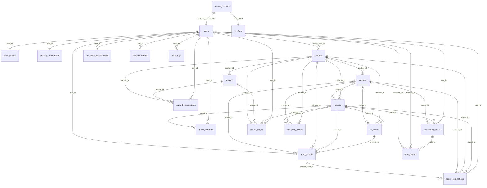

# SideQuests Database Schema Snapshot

> **What this is:** a derived, LLM-shareable reference of the Supabase Postgres schema as it
> should exist after applying `supabase/migrations/0001`–`0015` in order. It is a *snapshot*,
> not a source of truth: the migrations are authoritative (see `CLAUDE.md` §3), and
> `docs/architecture/DATABASE_SPEC.md` is the logical design reference.
>
> **Snapshot date:** 2026-09-27 · **Built from:** migrations 0001–0015 (repo, not live DB).
> **Verified:** all 15 migrations were applied in filename order to a local Postgres 16 with
> stubbed `auth`/`storage` schemas. 0006 stops at one statement (P11); the statements it then
> skips are re-done by 0004, 0010 and 0011, so the end state matched this file (20 tables,
> 2 views, 19 enums). P1, P2 and P10 below were reproduced there.
> **Pending:** `0016_rls_hardening.sql` fixes P1, P2 and P10 and is **not yet applied**; see §11.
> **Live verification:** not performed. The applied-migration ledger has drifted (CLAUDE.md §9). Run `scripts/schema-snapshot.sql` in the Supabase SQL editor to dump
> the live schema and diff it against this file.
>
> **How to use with another LLM:** paste this whole file. It is self-contained: context,
> ER diagram, consolidated DDL, security model, RPCs, and known pitfalls.

---

## 1. Context for the reader

- Product: SideQuests, a curated, mobile-first real-world quest app (Miami). Users scan a QR at a
  partner venue, complete a quest, earn **XP** (progression, non-spendable) and **Points**
  (spendable on rewards), and leave **Community Notes**.
- Stack: Vite + React SPA talks **directly** to Supabase (PostgREST + Auth + Storage + RPC).
  There is no backend server. Security = **RLS + table grants + SECURITY DEFINER RPCs**.
- Roles: `anon` (signed out), `authenticated` (signed in). `auth.uid()` equals `users.id`
  and `profiles.user_id`.
- All tables live in schema `public`. Every `id` is `uuid default gen_random_uuid()` unless noted.
- Integrity-sensitive writes (completions, points, redemptions, notes, scans) happen only
  through RPCs. Clients cannot insert into those tables directly (no grant).

## 2. Domains at a glance

| Domain | Tables |
|---|---|
| Identity | `users`, `user_profiles`, `privacy_preferences`, `profiles` (+ view `public_profiles`) |
| Partners & places | `partners`, `venues` |
| Quests | `quests`, `qr_codes` |
| Play tracking | `scan_events`, `quest_attempts`, `quest_completions` |
| Community | `community_notes`, `note_reports` (+ view `community_notes_with_author`) |
| Economy | `points_ledger`, `rewards`, `reward_redemptions` |
| Analytics | `leaderboard_snapshots`, `analytics_rollups` |
| Governance | `consent_events`, `audit_logs` |

**Two parallel identity models exist.** `users` / `user_profiles` / `privacy_preferences`
(the "game" model, updated by RPCs) and `profiles` (the "app" model, edited by the user in
Settings/onboarding). All four rows are created together by the `on_auth_user_created` trigger.

## 3. Entity-relationship diagram (Mermaid)



Notation: `||--o{` = required one-to-many; `|o--o{` = optional (nullable FK) one-to-many.

## 4. Enums

```sql
role                    ('user','partner','admin')
account_status          ('active','suspended','deleted')
partner_type            ('venue','brand','event','nonprofit','other')
partner_status          ('pending','active','suspended')
entity_status           ('draft','active','paused','archived')
quest_category          ('art','food','outdoors','culture','nightlife','shopping','fitness','hidden_gem')
difficulty              ('easy','medium','hard')
verification_type       ('qr','nfc','gps','venue_code','staff_approval')
scan_conversion_state   ('scanned','viewed','authenticated','started','completed')
attempt_status          ('in_progress','completed','failed','abandoned')
ledger_transaction_type ('earn','spend','adjust','expire')
ledger_source           ('quest_completion','reward_redemption','admin_adjustment','bonus','referral')
moderation_status       ('pending','approved','rejected','flagged')
redemption_status       ('issued','redeemed','expired','cancelled')
leaderboard_scope       ('global','city','venue','campaign')
leaderboard_period      ('weekly','monthly','all_time')
consent_type            ('analytics','marketing','location')
visibility              ('public','friends','private')
device_type             ('mobile','tablet','desktop','unknown')
```

## 5. Consolidated DDL (effective end state after 0001–0015)

Condensed: `id uuid pk` means `id uuid primary key default gen_random_uuid()`; `now` means
`timestamptz not null default now()`. Comments explain intent and origin migration.

```sql
-- ── Identity ────────────────────────────────────────────────────────────────
create table users (                         -- 0001_schema / 0006; id = auth.uid()
  id uuid pk,                                -- set from auth.users.id by trigger (no FK)
  email text unique,
  display_name text not null,
  avatar_url text,
  role role not null default 'user',
  created_at now,
  last_active_at now,
  account_status account_status not null default 'active'
);

create table user_profiles (                 -- game stats; mutated only by RPCs
  user_id uuid primary key references users(id) on delete cascade,
  home_city text,
  xp int not null default 0,
  level int not null default 1,              -- level_for_xp(xp), triangular curve
  points_balance_cache int not null default 0,  -- cache; points_ledger is the truth
  lifetime_points int not null default 0,
  completed_quests_count int not null default 0,
  community_notes_count int not null default 0,
  rewards_redeemed_count int not null default 0
);

create table privacy_preferences (
  user_id uuid primary key references users(id) on delete cascade,
  analytics_consent bool not null default true,
  marketing_consent bool not null default false,   -- seeded from signup opt-in (0015)
  location_consent bool not null default false,
  leaderboard_visibility visibility not null default 'public',
  profile_visibility visibility not null default 'public'
);

create table profiles (                      -- app profile; 0001_profiles + 0002/0004/0008/0011/0015
  user_id uuid primary key references auth.users(id) on delete cascade,
  display_name text,
  username text unique,
  avatar_url text,
  home_city text not null default 'Miami',
  interests text[] not null default '{}',
  quest_style text, quest_energy text, starting_area text,
  xp int not null default 0, level int not null default 1, streak int not null default 0,
  onboarding_completed bool not null default false,
  created_at now, updated_at now,            -- trigger profiles_set_updated_at
  bio text check (bio is null or char_length(bio) <= 280),
  instagram_url text, tiktok_url text, x_url text, youtube_url text, snapchat_url text,
  phone_number text check (phone_number is null or char_length(phone_number) <= 20), -- always private
  is_public bool not null default false,          -- CANONICAL visibility flag (0011)
  is_profile_public bool not null default false,  -- DEAD column, kept until code refs removed
  show_social_links bool not null default false,
  show_completed_quests bool not null default false,
  show_breadcrumbs bool not null default false,
  accepted_terms_at timestamptz, accepted_privacy_at timestamptz,   -- 0015 consent capture
  terms_version text, privacy_version text,
  marketing_opt_in bool not null default false, marketing_opt_in_at timestamptz
);

-- ── Partners & places ───────────────────────────────────────────────────────
create table partners (                      -- B2B account shell; may own several venues
  id uuid pk,
  name text not null,
  type partner_type not null default 'other',
  contact_email text not null default '',
  status partner_status not null default 'pending',
  owner_user_id uuid references users(id) on delete set null,
  created_at now
);

create table venues (                        -- customer-facing business the quester visits
  id uuid pk,
  partner_id uuid not null references partners(id) on delete cascade,
  name text not null,
  address text, city text,
  latitude double precision, longitude double precision,
  status entity_status not null default 'active',
  logo_url text, neighborhood text, hours text, hours_note text,  -- 0014
  price_range text                                                -- '$'..'$$$$'
);

-- ── Quests ──────────────────────────────────────────────────────────────────
create table quests (
  id uuid pk,
  partner_id uuid not null references partners(id) on delete cascade,
  venue_id uuid references venues(id) on delete set null,
  title text not null,
  description text not null default '',
  category quest_category not null default 'hidden_gem',
  difficulty difficulty not null default 'easy',
  xp_reward int not null default 50,
  points_reward int not null default 100,
  status entity_status not null default 'draft',
  start_date timestamptz, end_date timestamptz,
  verification_type verification_type not null default 'qr',
  verification_secret text,                  -- venue_code answer; see pitfall P1
  image_url text,
  created_at now,
  funky_action text,                         -- 0012 "Fable" content fields (all free text)
  action_type text, action_prompt text,
  proof_method text,                         -- camera|photo|staff_phrase|breadcrumb|qr|manual
  staff_phrase text, social_share_prompt text,
  estimated_time text,                       -- e.g. '10–15 min'
  links jsonb   -- { website_url, reviews_url, reviews_source, socials_url, socials_source }
);

create table qr_codes (
  id uuid pk,
  quest_id uuid not null references quests(id) on delete cascade,
  venue_id uuid references venues(id) on delete set null,
  partner_id uuid not null references partners(id) on delete cascade,
  code text not null unique,                 -- resolved by /scan/:code
  destination_url text not null,
  status entity_status not null default 'active',
  created_at now
);

-- ── Play tracking ───────────────────────────────────────────────────────────
create table scan_events (                   -- written by record_scan() RPC
  id uuid pk,
  qr_code_id uuid references qr_codes(id) on delete set null,
  quest_id uuid not null references quests(id) on delete cascade,
  venue_id uuid references venues(id) on delete set null,
  partner_id uuid not null references partners(id) on delete cascade,
  user_id uuid references users(id) on delete set null,   -- null when anonymous
  anonymous_session_id text not null,
  "timestamp" now,
  device_type device_type not null default 'unknown',
  browser text, operating_system text, referrer text, approximate_location text,
  location_permission_granted bool not null default false,
  conversion_state scan_conversion_state not null default 'scanned'
);

create table quest_attempts (                -- written by start_quest()/complete_quest()
  id uuid pk,
  user_id uuid not null references users(id) on delete cascade,
  quest_id uuid not null references quests(id) on delete cascade,
  started_at now, completed_at timestamptz,
  status attempt_status not null default 'in_progress',
  verification_method verification_type,
  failure_reason text
);

create table quest_completions (             -- written by complete_quest()
  id uuid pk,
  user_id uuid not null references users(id) on delete cascade,
  quest_id uuid not null references quests(id) on delete cascade,
  venue_id uuid references venues(id) on delete set null,
  partner_id uuid not null references partners(id) on delete cascade,
  completed_at now,
  xp_awarded int not null, points_awarded int not null,
  source_scan_id uuid references scan_events(id) on delete set null,
  unique (user_id, quest_id)                 -- anti-farming: one completion per quest
);

-- ── Community ───────────────────────────────────────────────────────────────
create table community_notes (               -- written by create_community_note()
  id uuid pk,
  user_id uuid not null references users(id) on delete cascade,
  quest_id uuid not null references quests(id) on delete cascade,
  venue_id uuid references venues(id) on delete set null,
  content text not null check (char_length(content) <= 280),
  image_url text,
  moderation_status moderation_status not null default 'approved',
  flag_count int not null default 0,         -- synced by note_reports trigger
  created_at now
);

create table note_reports (                  -- 0005; 3 reports flip an approved note to 'flagged'
  id uuid pk,
  note_id uuid not null references community_notes(id) on delete cascade,
  reporter_id uuid not null references users(id) on delete cascade,
  reason text not null check (reason in ('spam','inappropriate','inaccurate','offensive','other')),
  details text,
  status text not null default 'open' check (status in ('open','reviewed','dismissed')),
  reviewed_by uuid references users(id) on delete set null,
  reviewed_at timestamptz,
  created_at now,
  unique (note_id, reporter_id)
);

-- ── Economy ─────────────────────────────────────────────────────────────────
create table points_ledger (                 -- append-only source of truth for points & XP
  id uuid pk,
  user_id uuid not null references users(id) on delete cascade,
  transaction_type ledger_transaction_type not null,
  source ledger_source not null,
  points_amount int not null,                -- negative for spend
  xp_amount int not null default 0,
  quest_id uuid references quests(id) on delete set null,
  reward_id uuid references rewards(id) on delete set null,
  partner_id uuid references partners(id) on delete set null,
  metadata jsonb,
  created_at now
);

create table rewards (
  id uuid pk,
  partner_id uuid not null references partners(id) on delete cascade,
  title text not null,
  description text not null default '',
  points_cost int not null,
  inventory int,                             -- null = unlimited
  status entity_status not null default 'active',
  expiration_date timestamptz,
  image_url text
);

create table reward_redemptions (            -- written by redeem_reward()
  id uuid pk,
  user_id uuid not null references users(id) on delete cascade,
  reward_id uuid not null references rewards(id) on delete cascade,
  partner_id uuid not null references partners(id) on delete cascade,
  points_spent int not null,
  redemption_code text not null,             -- 'ABCD-1234' style
  status redemption_status not null default 'issued',
  redeemed_at now
);

-- ── Analytics ───────────────────────────────────────────────────────────────
create table leaderboard_snapshots (         -- not written by current app code
  id uuid pk,
  scope_type leaderboard_scope not null, scope_id text,
  user_id uuid not null references users(id) on delete cascade,
  score int not null, rank int not null,
  period leaderboard_period not null,
  created_at now
);

create table analytics_rollups (             -- not written by current app code
  id uuid pk,
  partner_id uuid not null references partners(id) on delete cascade,
  venue_id uuid references venues(id) on delete set null,
  quest_id uuid references quests(id) on delete set null,
  date date not null,
  scans int not null default 0, unique_visitors int not null default 0,
  authenticated_users int not null default 0, completions int not null default 0,
  rewards_redeemed int not null default 0, community_notes_created int not null default 0,
  unique (partner_id, venue_id, quest_id, date)
);

-- ── Governance ──────────────────────────────────────────────────────────────
create table consent_events (                -- append-only consent log (client inserts)
  id uuid pk,
  user_id uuid not null references users(id) on delete cascade,
  consent_type consent_type not null,
  granted bool not null,
  "timestamp" now,
  source text not null
);

create table audit_logs (                    -- written by RPCs
  id uuid pk,
  actor_id uuid references users(id) on delete set null,
  action text not null,                      -- e.g. 'quest.completed', 'reward.redeemed'
  entity_type text not null, entity_id text,
  metadata jsonb,
  created_at now
);

-- ── Views ───────────────────────────────────────────────────────────────────
-- Runs as view owner (security_invoker = false); see pitfall P2.
create view community_notes_with_author as
  select n.*, u.display_name as author_display_name, u.avatar_url as author_avatar_url
  from community_notes n join users u on u.id = n.user_id;

-- Privacy-safe public profile projection (security_invoker = false, intentional).
create view public_profiles as
  select user_id, display_name, username, avatar_url, home_city, bio, level, xp, created_at,
         case when show_social_links then instagram_url end as instagram_url,
         case when show_social_links then tiktok_url    end as tiktok_url,
         case when show_social_links then x_url         end as x_url,
         case when show_social_links then youtube_url   end as youtube_url,
         case when show_social_links then snapchat_url  end as snapchat_url,
         show_completed_quests, show_breadcrumbs
  from profiles where is_public = true;      -- phone_number never exposed
```

**Indexes:** `quests(status)`, `quests(partner_id)`, `scan_events(partner_id, timestamp desc)`,
`scan_events(quest_id)`, `quest_completions(user_id)`, `quest_completions(partner_id)`,
`points_ledger(user_id, created_at desc)`, `community_notes(quest_id, moderation_status)`,
`reward_redemptions(partner_id)`, `note_reports(note_id)`, `note_reports(reporter_id)`,
`note_reports(status)`, plus PK/unique indexes.

## 6. Triggers

| Trigger | On | Function | Effect |
|---|---|---|---|
| `on_auth_user_created` | `auth.users` after insert | `handle_new_auth_user()` | Creates `users`, `user_profiles`, `privacy_preferences`, `profiles` rows; stamps consent fields from signup metadata (0015) |
| `profiles_set_updated_at` | `profiles` before update | `set_updated_at()` | Maintains `updated_at` |
| `note_reports_sync_flags` | `note_reports` after insert/delete | `sync_note_flag_count()` | Recounts `flag_count`; at ≥3 moves an `approved` note to `flagged` |

## 7. RPCs (all `SECURITY DEFINER`, `search_path = public`)

| Function | Returns | What it does |
|---|---|---|
| `record_scan(p_quest_id, p_qr_code_id, p_anonymous_session_id, p_device_type, p_browser, p_operating_system, p_referrer)` | `scan_events` | Appends a scan (anon or authed) |
| `start_quest(p_quest_id)` | `quest_attempts` | Opens an in-progress attempt |
| `complete_quest(p_quest_id, p_verification_method, p_venue_code, p_source_scan_id)` | `jsonb {ok, completion, xpAwarded, pointsAwarded, newLevel, leveledUp}` or `{ok:false, error}` | Validates active window, venue code, one-per-user; writes completion + ledger + stats + audit |
| `redeem_reward(p_reward_id)` | `jsonb {ok, redemption}` / `{ok:false, error}` | Checks status/expiry/inventory/balance; writes redemption + negative ledger row |
| `create_community_note(p_quest_id, p_content, p_image_url)` | `jsonb` | Only completers may post; ≤280 chars |
| `adjust_points(p_user_id, p_points, p_xp, p_reason)` | `points_ledger` | Admin adjustment |
| `get_leaderboard(p_scope, p_scope_id, p_period, p_limit)` | `table(rank, user_id, display_name, avatar_url, score)` | Computed leaderboard |
| `partner_analytics(p_partner_id)` | `jsonb` | Partner dashboard metrics |
| `platform_analytics()` | `jsonb` | Admin metrics |
| `create_qr_code(p_quest_id, p_partner_id, p_venue_id)` | `qr_codes` | Generates a unique short code |
| `level_for_xp(p_xp)` | `int` | Triangular curve: level n needs `100·n(n−1)/2` XP (matches `src/lib/app/leveling.ts`) |
| RLS helpers: `app_uid()`, `is_admin()`, `owns_partner(p_partner_id)` | | Used inside policies |

## 8. Security model: RLS policies + grants

A read needs **both** a grant and an RLS policy. No table has a DELETE grant.

| Table | anon grant | authenticated grant | RLS (who sees / writes which rows) |
|---|---|---|---|
| partners | SELECT | SELECT, INSERT, UPDATE | read all; manage if `owns_partner(id)` |
| venues | SELECT | SELECT, INSERT, UPDATE | read all; manage if owns partner |
| quests | SELECT | SELECT, INSERT, UPDATE | read `status='active'` or owner; manage if owner |
| qr_codes | SELECT | SELECT | read active or owner; manage if owner |
| rewards | SELECT | SELECT, INSERT, UPDATE | read active or owner; manage if owner |
| community_notes | SELECT | SELECT, UPDATE(moderation_status) | read approved / own / admin; admin updates |
| community_notes_with_author (view) | SELECT | SELECT | none (runs as owner) |
| leaderboard_snapshots | SELECT | SELECT | read all |
| public_profiles (view) | SELECT | SELECT | filtered by `is_public` in view |
| profiles | SELECT | SELECT, INSERT, UPDATE | owner only (select/insert/update) |
| users | – | SELECT, UPDATE | self read (or admin); self update |
| user_profiles | – | SELECT, UPDATE | self read (or admin); self update |
| privacy_preferences | – | SELECT, INSERT, UPDATE | self, all ops |
| consent_events | – | SELECT, INSERT | self, all ops |
| quest_attempts | – | SELECT | self or admin |
| quest_completions | – | SELECT | self or owning partner |
| points_ledger | – | SELECT | self or admin |
| reward_redemptions | – | SELECT | self or owning partner |
| scan_events | – | SELECT, UPDATE(conversion_state) | read by owning partner; no update policy |
| audit_logs | – | SELECT | admin only |
| note_reports | – (not in 0009) | – (not in 0009) | insert as self; read own or admin; admin resolves |
| analytics_rollups | – | – | read by owning partner (no grant, so unreachable via PostgREST) |

## 9. Storage buckets

| Bucket | Public read | Size cap | MIME | Write rule |
|---|---|---|---|---|
| `avatars` | yes | 5 MB | jpeg, png, webp | authenticated, own `{uid}/…` folder |
| `proofs` | yes | 25 MB | webp, jpeg, png, webm, mp4 | authenticated, own `{uid}/quests/{questId}/…` folder |

## 10. Known pitfalls and drift (read before changing anything)

These come from the migrations (P1, P2, P10, P11 reproduced on a local build); confirm each live.
P1, P2 and P10 are fixed by `0016_rls_hardening.sql` once it is applied (§11).

- **P10. Signed-out reads break when a non-public row exists.** `is_admin()`, `owns_partner()`
  and `app_uid()` are plain `SECURITY INVOKER` SQL functions that read `public.users`, and
  `anon` has no grant on `users`. Policies like `status = 'active' or owns_partner(partner_id)`
  fall through to `is_admin()` for any draft/paused quest (same for `qr_codes`, `rewards`, and
  non-approved `community_notes`), so the whole anon `SELECT` fails with
  `permission denied for table users`. **Fix in 0016:** the helpers become `SECURITY DEFINER`
  with an empty `search_path`.

- **P1. `quests.verification_secret` is readable by `anon`.** The table-level `SELECT` grant plus
  `quests_public_read` exposes every column of active quests, including the venue-code answer
  that `complete_quest()` checks. Anyone can read the secret with the public anon key.
  **Fix in 0016:** secrets move to server-only `quest_secrets`.
- **P2. `community_notes_with_author` bypasses note moderation.** It is a plain view (runs as
  owner), selects `n.*` with no `moderation_status` filter, and is granted to `anon`. Pending,
  rejected and flagged notes are readable through it unless the client filters.
  **Fix in 0016:** the view's WHERE clause re-applies `notes_public_read`.
- **P3. Two XP/level stores.** `complete_quest()` updates `user_profiles.xp/level`;
  `public_profiles` exposes `profiles.xp/level`, which no RPC updates.
- **P4. `profiles.is_profile_public` is dead.** `is_public` is canonical (0011).
- **P5. `profiles` public-read policy.** 0009 mentions a "public-visibility select policy" on
  `profiles` that no checked-in migration creates. It may exist live only.
- **P6. `note_reports` has no grants** in 0009, so the reporting flow cannot work through
  PostgREST until grants are added. `analytics_rollups` has an RLS policy but no grant.
- **P7. `scan_events` UPDATE is a silent no-op** (column grant, no UPDATE policy); conversion
  to `completed` happens inside `complete_quest()` instead.
- **P8. Unused tables:** `leaderboard_snapshots`, `analytics_rollups` are not written by app code
  (leaderboard and analytics are computed on read by RPCs).
- **P9. Ledger drift.** Some migrations were applied out-of-band; the 0012 Fable columns existed
  live before the migration. Always verify live state.
- **P11. A fresh build stops inside 0006.** Run in filename order, 0006 line 434
  (`create or replace view community_notes_with_author … n.*`) fails with
  `cannot change name of view column "author_display_name" to "flag_count"`, because 0005 already
  added `flag_count`. Everything after that line in 0006 is skipped (or the whole file rolls back,
  if it runs in one transaction). Later migrations re-do what matters, but any automated
  from-scratch build (`supabase db reset`, a branch) will stop here. Not fixed.

## 11. Pending: `0016_rls_hardening.sql` (authored, not applied)

Apply in the SQL editor after a backup; the file's header lists pre-checks and its footer has
verification queries and a rollback. `scripts/verify-db.sql` checks 18–20 cover it. Once applied:

- `is_admin()`, `owns_partner()`, `app_uid()` become `SECURITY DEFINER`, `search_path = ''`.
- New table (RLS on, no policies, no `anon`/`authenticated` privileges):
  ```sql
  create table quest_secrets (
    quest_id uuid primary key references quests(id) on delete cascade deferrable initially deferred,
    verification_secret text not null check (char_length(trim(verification_secret)) > 0),
    updated_at timestamptz not null default now()
  );
  ```
- `quests.verification_secret` stays in the table but is always NULL: trigger
  `quests_stash_secret` (before insert/update, `stash_quest_secret()`) moves any non-blank
  value into `quest_secrets`. `complete_quest()` reads the code from `quest_secrets`.
- `community_notes_with_author` is recreated with `security_barrier` and
  `where moderation_status = 'approved' or user_id = auth.uid() or is_admin()`.
